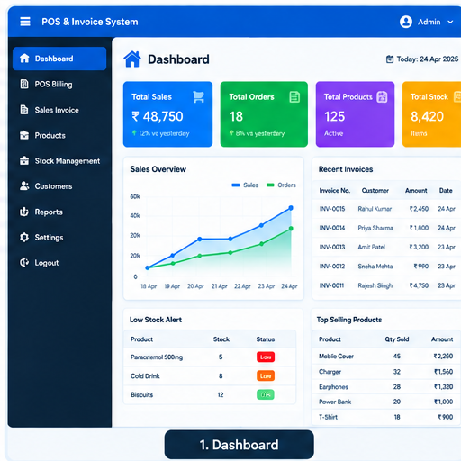
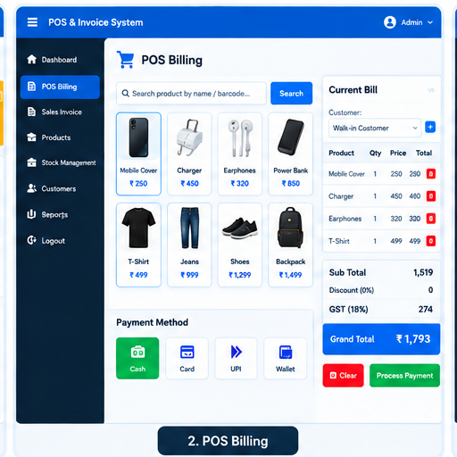
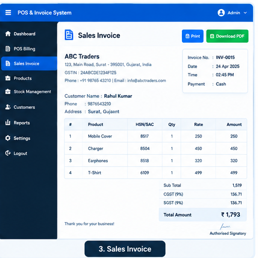
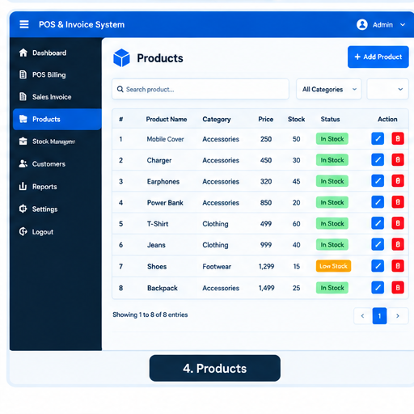
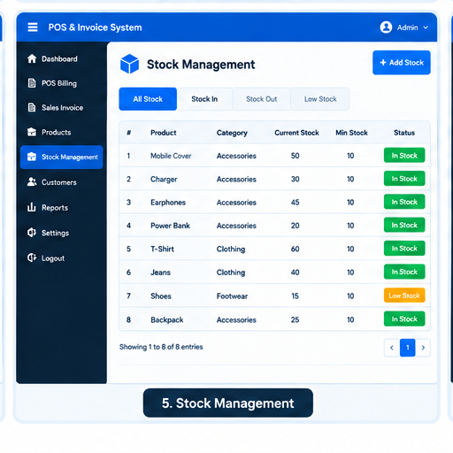
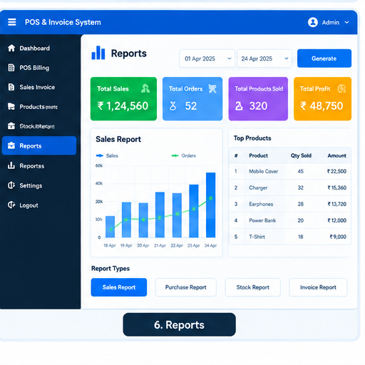

# POS & Invoice Management System

A web-based POS and Invoice Management System developed using PHP and MySQL.

This application is designed to manage sales, products, inventory, customers, invoices and business reports through a centralized web-based system.

---

## 🚀 Features

- 📊 Dashboard
- 🧾 POS Billing
- 🧾 Sales Invoice Management
- 🛍️ Product Management
- 📦 Stock Management
- 👥 Customer Management
- 📈 Sales Reports
- 🖨️ Invoice Printing
- 🔎 Product Search
- 💾 MySQL Database
- 📱 Responsive Interface
- ⚡ AJAX-based Operations

---

## 🛠️ Technologies

### Backend
- PHP

### Database
- MySQL

### Frontend
- HTML5
- CSS3
- Bootstrap
- JavaScript
- jQuery

### Additional
- AJAX
- JSON
- XAMPP
- Git
- GitHub

---

## 📸 Screenshots

### Dashboard



### POS Billing



### Sales Invoice



### Products



### Stock Management



### Reports



---

## 📂 Project Structure

```text
php-pos-invoice-system/
│
├── assets/
├── css/
├── js/
├── images/
├── includes/
├── screenshots/
│
├── database.sql
├── index.php
├── dashboard.php
├── products.php
├── sales.php
├── invoice.php
└── README.md
